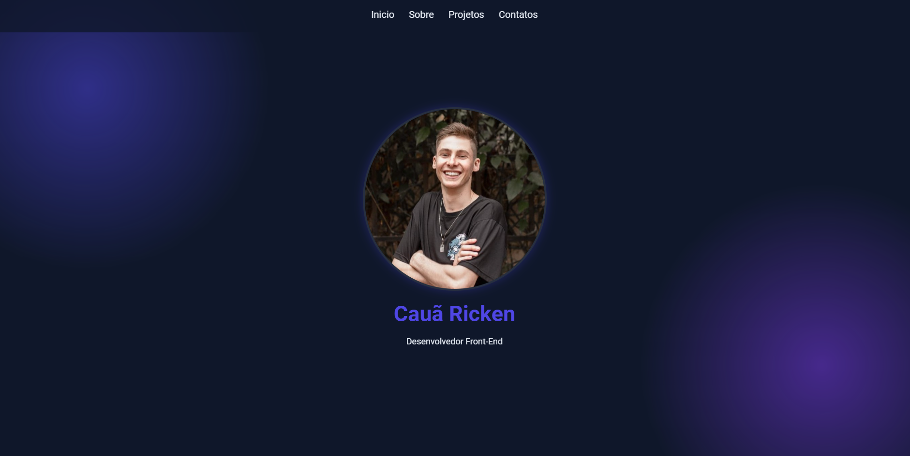

# 🧑‍💻 Portfólio - Cauã Ricken

Este é meu portfólio pessoal, desenvolvido com HTML, CSS e JavaScript, onde apresento meus projetos, habilidades e uma forma de contato direto via WhatsApp. O site foi pensado com foco em design moderno, responsividade e uma navegação simples.

## 🔗 Acesse o site

👉 [Clique aqui para acessar o portfólio online](https://dev-caua-ricken.github.io/)

---

## ✨ Funcionalidades

- ✅ Interface responsiva para diferentes tamanhos de tela.
- ✅ Navegação suave entre seções.
- ✅ Apresentação dos principais projetos.
- ✅ Formulário de contato com envio direto para o WhatsApp.
- ✅ Animações e efeitos visuais com CSS.
- ✅ Ícones interativos do GitHub e LinkedIn no rodapé.

---

## 🛠 Tecnologias Utilizadas

- **HTML5**
- **CSS3**
- **JavaScript**
- **Font Awesome**
- **Google Fonts**

---

## 💼 Projetos em Destaque

- [🥤 Projeto Refrigerante](https://dev-caua-ricken.github.io/refrigerante/)
- [🍷 WineHub](https://dev-caua-ricken.github.io/WineHub/)
- [🌤 Previsão do Tempo](https://dev-caua-ricken.github.io/weather/)

---

## 📱 Contato

Você pode entrar em contato diretamente pelo formulário do site, que envia sua mensagem via WhatsApp, ou pelos links abaixo:

- GitHub: [Dev-Caua-Ricken](https://github.com/Dev-Caua-Ricken)
- LinkedIn: [Cauã Ricken](https://www.linkedin.com/in/cauã-ricken-983b28318/)

---

## 📃 Licença

Este projeto é de uso pessoal e educativo. Sinta-se livre para se inspirar, mas por favor, não copie diretamente sem autorização.

---
